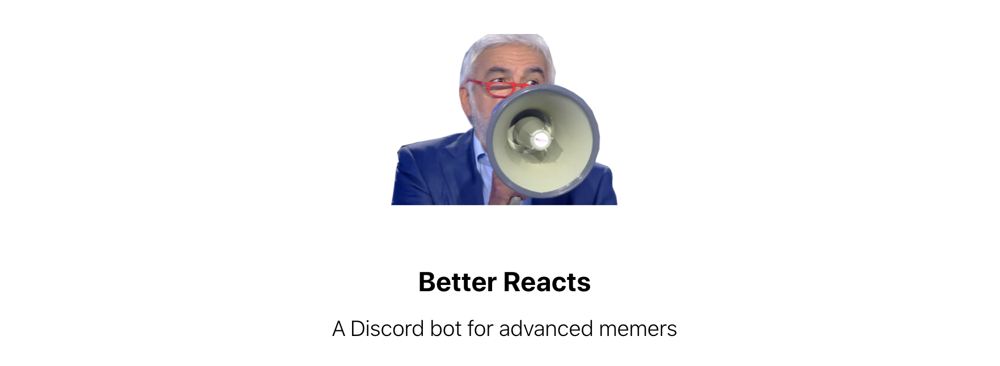
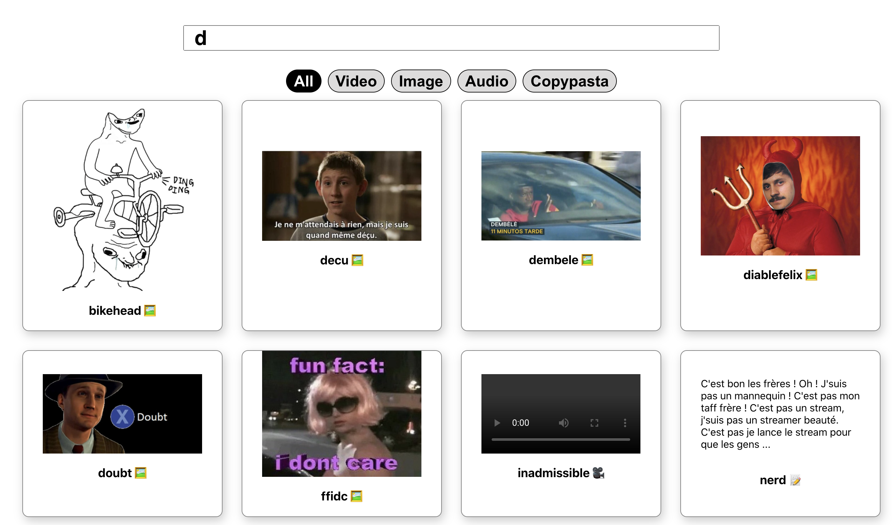
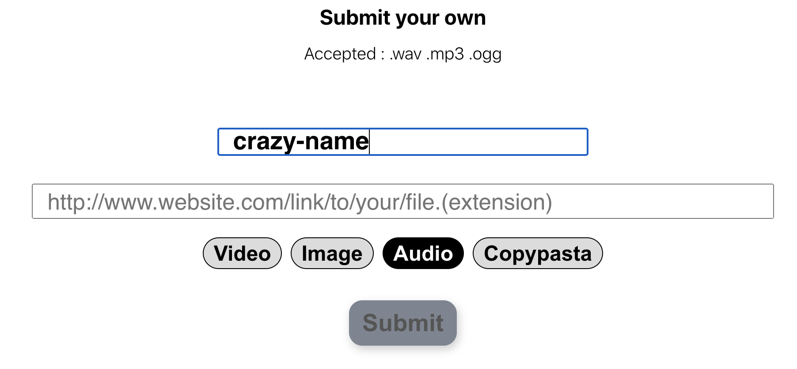

<h2 align="center">Web Dashboard</h2>

Afin de lister et de pouvoir rajouter du contenu au [bot discord](https://github.com/Hugo-M33/better-reacts-bot), il a fallu créer un [dashboard](https://better-reacts.netlify.app/) :smile:

C'est un petit projet **react.JS** pour tester **Firebase**, Les **fonctions netlify**, et légèrement toucher aux **PWA**

## Home

Simple grille responsive avec possibilité de filtrer par type de média et une recherche par nom

## Submit

Permet d'ajouter du contenu au bot en précisant type, nom et lien du média.

Le choix de firebase et des netlify functions rendait compliqué l'envoi de fichier, le traitement et le stockage de fichiers.

